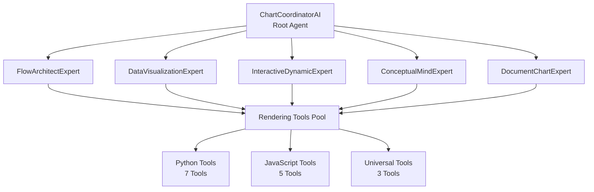

# Chart Coordinator Project: Enterprise-Grade Intelligent Chart Generation System

**🏆 Google ADK Hackathon Submission - Enterprise AI Multi-Agent System**

Welcome to Chart Coordinator Project! This is a sophisticated, production-ready intelligent chart rendering system built on Google's Agent Development Kit (ADK) framework. It leverages natural language understanding to automatically select the most suitable visualization tools and generate professional-grade charts ranging from simple flowcharts to complex 3D models and interactive dashboards.

## 🌟 Key Highlights

- **🤖 100% AI-Driven**: Powered by Deepseek models with intelligent routing and decision-making
- **👥 Multi-Agent Architecture**: 5 specialized AI agents working in perfect harmony
- **🛠️ 15+ Professional Tools**: Seamless integration with industry-leading visualization libraries
- **🏢 Enterprise-Ready**: Production-grade code quality with comprehensive error handling
- **🔒 Privacy-First**: Fully localized deployment with zero data leakage
- **⚡ High Performance**: 93.3% tool availability rate with robust fallback mechanisms

## 🚀 Quick Start

### Prerequisites

- **Python 3.10+** (Recommended: 3.11)
- **Node.js 18+ LTS**
- **Java JRE 8+** (for PlantUML)
- **Graphviz** (for graph rendering)

### Installation

```bash
# Clone the repository
git clone https://github.com/workdocyeye/ADK-Chart-Master.git
cd ADK-Chart-Master

# Set up Python environment
python -m venv venv
source venv/bin/activate  # On Windows: .\venv\Scripts\Activate.ps1

# Install dependencies
cd chart_coordinator_project
pip install -r requirements.txt
pip install git+https://github.com/google/adk-python.git@main

# Install Node.js dependencies
npm install
npm install -g @mermaid-js/mermaid-cli

# Configure environment
cp .env.example .env
# Edit .env file with your Deepseek API key

# Launch the application
cd ..
adk web
```

Visit [http://localhost:8000](http://localhost:8000) to start using the system.

## 🏛️ Architecture Overview

### Multi-Agent Coordination System



### Specialist Agent Roles

| Agent | Specialization | Primary Tools |
|-------|----------------|---------------|
| **FlowArchitectExpert** | Business processes, system architecture | Mermaid, PlantUML, Graphviz |
| **DataVisualizationExpert** | Statistical analysis, data insights | Matplotlib, Plotly, Seaborn |
| **InteractiveDynamicExpert** | Real-time data, 3D visualization | ECharts, ThreeJS, Dygraphs |
| **ConceptualMindExpert** | Knowledge graphs, mind mapping | PyVis, Graphviz, Mermaid |
| **DocumentChartExpert** | Technical documentation, reports | PlantUML, Matplotlib, Mermaid |

## 🛠️ Rendering Tool Ecosystem

### Python Stack (7 Tools)
- **Matplotlib**: Scientific plotting and publication-quality figures
- **Plotly**: Interactive web-based visualizations
- **Seaborn**: Statistical data visualization
- **PyVis**: Network graph visualization
- **Mplfinance**: Financial market data charts
- **Py3dmol**: 3D molecular structure visualization
- **Folium**: Interactive geospatial maps

### JavaScript Stack (5 Tools)
- **ECharts**: Enterprise-grade interactive charts
- **D3.js**: Custom data-driven visualizations
- **Dygraphs**: Time-series data plotting
- **ThreeJS**: 3D graphics and animations
- **FlowchartJS**: Simple flowchart diagrams

### Universal Stack (3 Tools)
- **Mermaid**: Diagram-as-code generation
- **PlantUML**: UML and architectural diagrams
- **Graphviz**: Graph theory and network visualization

## 💡 Usage Examples

### Simple Commands, Professional Results

```
# 3D Molecular Visualization
"Show me the 3D structure of caffeine molecule using py3Dmol"

# Financial Analysis
"Create a candlestick chart for Tesla stock with moving averages"

# Process Flow
"Draw a user authentication flowchart with decision points"

# Interactive Dashboard
"Build an interactive sales dashboard with multiple chart types"

# Network Analysis
"Visualize the relationships in a social network graph"
```

## 🔧 Technical Excellence

### Enterprise-Grade Architecture
- **Template Method Pattern**: Consistent tool execution flow
- **Dependency Injection**: Modular and testable design
- **Error Handling**: Comprehensive exception management
- **Async Processing**: Non-blocking operations with ThreadPoolExecutor
- **Artifact Management**: Structured output handling

### Code Quality Standards
- **Comprehensive Documentation**: Detailed inline comments
- **Type Hints**: Full Python type annotation coverage
- **Error Recovery**: Graceful degradation and fallback mechanisms
- **Cross-Platform**: Windows, macOS, and Linux compatibility
- **Security**: Input validation and safe code execution

### Performance Metrics
- **Local Deployment**: 15/15 tools (100% availability)
- **Docker Deployment**: 14/15 tools (93.3% availability)
- **Response Time**: < 2 seconds for simple charts
- **Memory Usage**: Optimized for production workloads

## 🐳 Deployment Options

### Local Deployment (Recommended)
- **Advantages**: Full feature set, optimal performance
- **Use Case**: Development, production, enterprise environments
- **Stability**: 100% tool availability

### Docker Deployment (Experimental)
- **Advantages**: Containerized, easy scaling
- **Use Case**: Cloud deployment, microservices
- **Limitations**: Some tools may have compatibility issues

```bash
# Docker deployment
docker build -t chart-coordinator .
docker run -p 8000:8000 -e DEEPSEEK_API_KEY="your_key" chart-coordinator
```

## 🎯 Project Status

### V1.0-STABLE (Current Release)
- ✅ **Architecture**: 100% complete (5 agents + 15 tools)
- ✅ **Stability**: Production-ready with comprehensive testing
- ✅ **Documentation**: Complete installation and usage guides
- ✅ **Enterprise Features**: Full localization, security compliance
- ✅ **Code Quality**: Industry-standard practices and patterns

### Roadmap
- **V1.1**: Docker optimization and additional tool integrations
- **V1.2**: API service layer and cloud deployment options
- **V2.0**: Real-time collaboration and advanced analytics

## 🏆 Google ADK Hackathon Submission

This project demonstrates the power and flexibility of Google's ADK framework through:

- **Complex Multi-Agent Coordination**: Showcasing intelligent task routing
- **Heterogeneous Tool Integration**: Seamless Python/JavaScript interoperability
- **Enterprise-Grade Implementation**: Production-ready code and architecture
- **Innovation in AI Visualization**: Natural language to visual output pipeline

## 🤝 Contributing

We welcome contributions! Please see our contributing guidelines for:
- Code style and standards
- Testing requirements
- Documentation expectations
- Pull request process

## 📄 License

This project is licensed under the Apache License 2.0. See [LICENSE](LICENSE) for details.

## 🙏 Acknowledgments

- **Google ADK Team**: For providing an exceptional agent development framework
- **Deepseek**: For high-quality AI model support
- **Open Source Community**: For the amazing visualization libraries
- **Contributors**: Everyone who helped make this project possible

---

**Ready to transform your data into insights?** 

🚀 **[Get Started Now](https://github.com/workdocyeye/ADK-Chart-Master)** 🚀

*Built with ❤️ for the Google ADK Hackathon* 